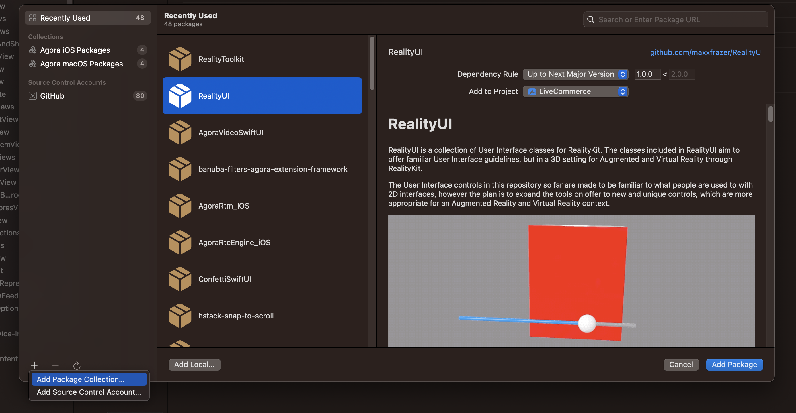

# RealityKit Swift Package Collection

Here you can find a collection of all the best Swift Packages that use RealityKit.

To add this package collection to Xcode, open the `File > Add Packages...` window, then select the plus icon at the bottom left:



Add the following URL:

```
https://github.com/maxxfrazer/RealityKit-Package-Collection/releases/download/main-release/RealityKit-Package-Collection.json
```

To get the nightly build, which is unsigned:

```
https://github.com/maxxfrazer/RealityKit-Package-Collection/releases/download/main-release/RealityKit-Package-Collection-Nightly.json
```